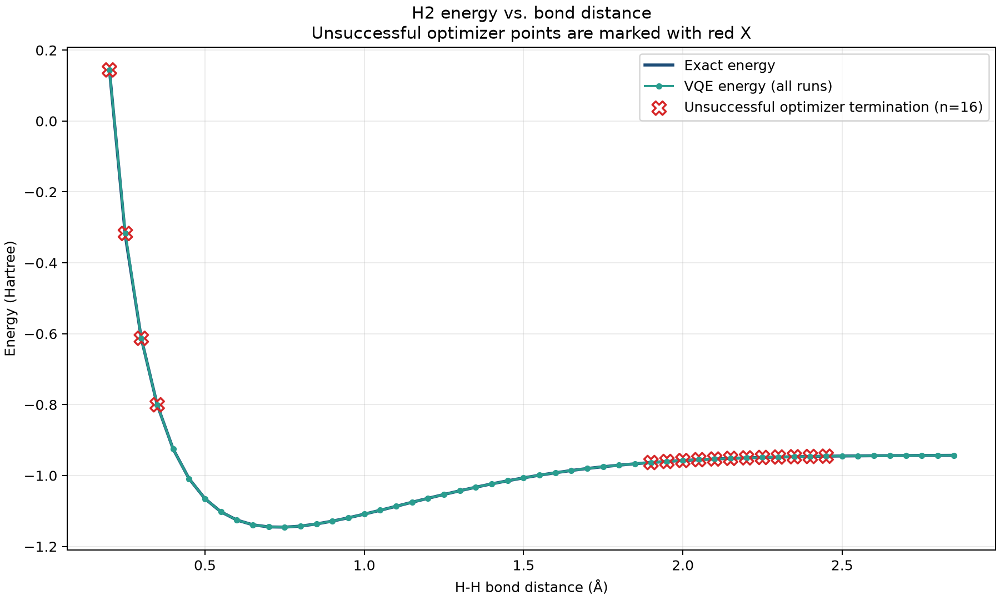

# Qiskit Fall Fest 2026 — Industry Challenge I5

## Slide 1 — Problem → Solution

### Molecule Energy Estimator

- **Industry need:** pharma and materials firms need molecular ground-state energy estimates.
- **Demonstration:** H2 represented by a two-qubit Hamiltonian.
- **Method:** Qiskit VQE on a statevector simulator, optimized with COBYLA.
- **Benchmark:** independent exact classical eigensolver provides the reference.
- **Workflow:** Molecule → Hamiltonian → VQE → Exact Benchmark.

### Speaker notes

Challenge I5 asks how a pharma or materials team could estimate a molecule's
ground-state energy. We built a small H2 demonstration with a two-qubit
Hamiltonian. Qiskit VQE explores ansatz parameters on a statevector
simulator, while COBYLA performs the classical optimization. An independent
exact eigensolver provides a transparent benchmark.

## Slide 2 — Results: VQE vs Exact

- **54** bond-distance points: **38** successful terminations; **16** reached the evaluation limit (**70.4%** success).
- **Minimum exact energy:** -1.1455991241236425 Ha at 0.75 Angstrom.
- **Minimum VQE energy:** -1.1455991230750247 Ha at 0.75 Angstrom.
- **Largest absolute error:** 0.00680139457299378 Ha at 0.25 Angstrom.
- Convergence was **not uniform** across all bond distances; unsuccessful points remain visible.

### Speaker notes

The experiment covers all 54 published bond-distance points. COBYLA
terminated successfully on 38 and reached the maximum evaluation count on
16, giving a 70.4 percent success rate. The minimum exact and VQE energies
occur at 0.75 Angstrom and are close there. The largest absolute error is
at 0.25 Angstrom. The red X markers show unsuccessful terminations directly;
the overall result makes clear that convergence is not uniform.

## Slide 3 — Business Value → Limits → Next Step

- **Workflow value:** molecular Hamiltonian → VQE estimate → classical benchmark → visible error and convergence analysis.
- **Scale and benchmark:** H2 is a very small problem, and exact classical benchmarking is feasible at this scale.
- **Observed limit:** 16/54 points reached the evaluation limit; convergence varies across the distance range.
- **Scope:** simulator-only results; no quantum advantage is established.
- **Scale-up risks:** larger molecules add chemistry, mapping, circuit-depth, noise, and scalability challenges.
- **Next step:** improve optimizer/convergence handling, then test a somewhat larger example such as LiH. **LiH has not been implemented.**

### Speaker notes

The value demonstrated is a workflow for comparing a VQE estimate with an
exact classical reference and making errors and convergence visible. This
is a simulator-only H2 prototype, not evidence of quantum advantage; exact
classical solution is practical at this scale. Larger chemistry cases bring
additional mapping, circuit, noise, and scalability challenges. A sensible
next step is better convergence handling, followed by a larger example
such as LiH, which is not part of this project.
